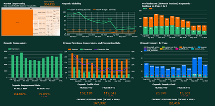
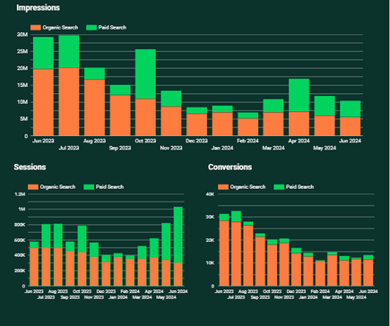
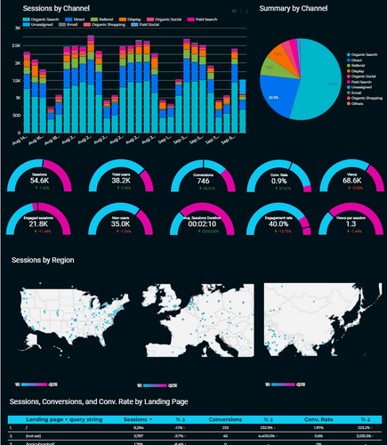

# Logan Overstreet — Analytics Portfolio
Marketing Analytics Engineer | SQL · Python · Adobe/GA4 · Power BI

## SEO Market Opportunity Dashboard

**Question:** Where are the biggest untapped organic search opportunities?

**Stack:** Python ETL from 4 APIs → cloud database → [BI tool]

**Outcome:** Revealed biggest keyword and page optimization opportunities

## Integrated SEO/SEM Dashboard

**Question:** How do paid and organic search work together?

**Stack:** 4 sources unified via Python → MySQL → [BI tool]

**Outcome:** Allowed us to recalibrate paid search spending to ensure holistic coverage as SEO went up or waned

## Web Analytics Performance Dashboard

**Question:** Which channels and pages drive leads and pipeline?

**Stack:** GA4 + CRM → MySQL → [BI tool]

**Outcome:** Identifying highest converting channels and pages to focus CRO efforts on
